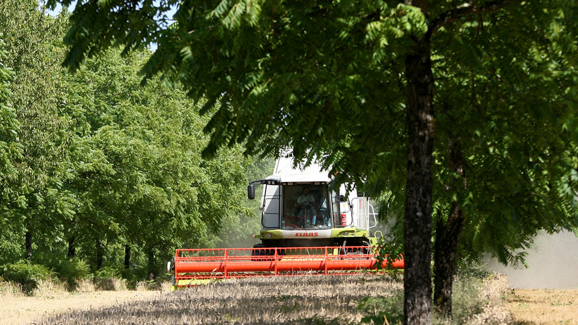

# Keyline Design

## About

This is a modification for Farming Simulator 25 which assists with the placement of parallel lines of trees which either follow the terrain or are just a straight line.
It uses an additional executable for doing heavy calculations efficiently in background. For this reason, this mod won't be on modhub anytime soon, unfortunately.

The idea of this mod is that you'll only ever use it to set up a savegame and rarely use it after. Therefore, it is not optimized for convenience or performance at the moment - as long as there is _some_ way to achieve what you want, it's considered good enough.

## Video guide

## How to use

1. Download the newest FS25_KeylineDesign.zip and keyline_calc.exe from the releases page
2. Run the executable (double click, or start from command line, or if you don't trust the exe, build it yourself with `cargo` from the `rust` directory, then run that).
3. In the command line window of the executable, enter the save slot number you are going to play. If you want a different save slot, you need to restart the keyline_calc.exe. It is recommended to place the executable window on a second screen if you have it.
4. Start the game and load the save (can do that earlier, does not matter)
5. Open the construction screen (Shift+P by default)
6. Select the last category in either the 2nd menu (for grapes etc) or the 5th menu (for agroforestry/keyline design)
7. Check the help menu and use the `F`, `K`, `L`, `N`, `M` options as required
8. Move the mouse to the desired position of the central line. When not using straight lines, this line will follow the terrain. Any other line will always be parallel to the central line.
9. Right click to export field data from the game
10. Check the keyline_calc window and wait until it says "Wrote x parallel lines to parallel_lines.xml". If that failed, try another location ingame.
11. Press B to display parallel lines to the keyline which was exported
12. When happy, left click to place the parallel lines. Otherwise, pick a different location and repeat from step 9
13. When placing grapes, you may experience heavy framedrops. Don't do anything until they are gone.

## Background information

Agroforestry:

- [Basics of Agroforestry](https://www.youtube.com/watch?v=jLZ0KtNx354)
- [What is agroforestry?](https://www.youtube.com/watch?v=MZ6No1mL1QM)

Keyline Design:

- [Keyline in the AR Sandbox (Playlist)](https://www.youtube.com/watch?v=yKGvj50r_6w&list=PLNdMkGYdEqOAacDMD_7fZhGwc_NUdOw3n)

## Recommended mods

- [Natural Water Rivers and Ponds Pack](https://www.farming-simulator.com/mod.php?lang=en&country=gb&mod_id=305489) for Permaculture Swales
- [Fenceless Husbandries](https://www.farming-simulator.com/mod.php?lang=en&country=ca&mod_id=232645) for having animals graze your agroforests
- [Tramline Shop Filter](https://www.farming-simulator.com/mod.php?mod_id=317571&title=fs2025) for helping you find equipment which fits your strip width